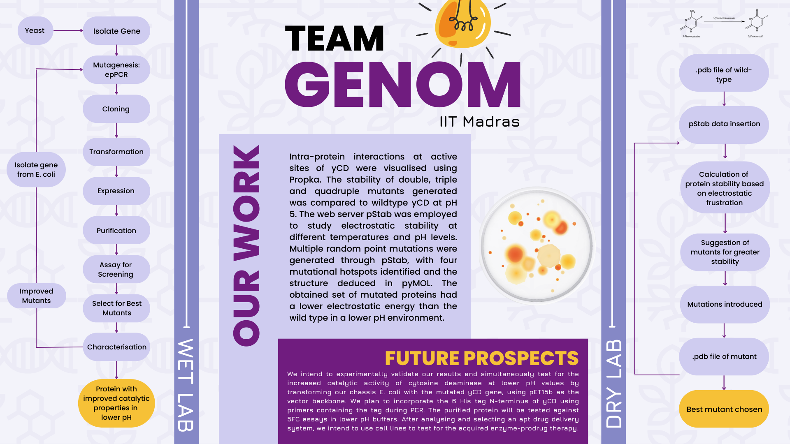

{: style="height:130px;width:130px;float:right;margin:20px"}
# Directed Evolution of Cytosine Deaminase with Enhanced pH Stability for Targeted Cancer Therapy

{: style="width:700px;margin:20px;display: block;margin-left: auto;margin-right: auto;"}
Traditional cancer therapies such as chemotherapy, radiation therapy, and surgery pose safety, selectivity, and efficacy concerns. Enzyme-prodrug therapies are an emerging treatment employing enzymes to convert prodrugs to active forms at specific target sites in the body. Yeast cytosine deaminase (yCD) is an enzyme which catalyzes the reaction of 5-fluorocytosine (5FC) to 5-fluorouracil (5FU), which behaves as an anti-metabolite in tumor cells and inhibits DNA and RNA synthesis. Our project is based on enhancing the stability of yCD in the lower pH domains of tumor microenvironments in the body, ranging from 5.6 - 6.8. 

Our workflow was divided into dry lab and planned implementation. Planned implementation gave detailed insights into directed evolution principles such as generating mutant libraries through error-prone PCR, and screening for the best mutants by subjecting them to various pH buffers and assaying by varying concentrations of 5-FC. On the other hand, dry lab work utilized techniques such as computer-based site-specific mutagenesis, multiple residue mutations and molecular modeling software to identify stable mutants at lower pH values.

[Back to top](#)
