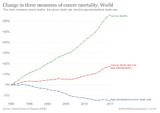

# Background

# **Why improve existing cancer therapies?**
&nbsp;&nbsp;&nbsp;&nbsp;&nbsp;&nbsp;&nbsp;&nbsp;&nbsp;&nbsp;Cancer is amongst the largest killers in the world, with over 9.9 million people succumbing to its throes in the year 2021. The most widely accepted treatment for this is chemotherapy, which can pose deleterious effects to not only malignant, but also healthy cells of the body, along with reduction of the immune response due to its non-specificity and low efficacy. There is an immediate need to introduce targeted therapeutic drugs in order to combat more aggressive cancers. Realizing this tremendous potential for improved forms of targeted cancer therapy, our team resolved to work on a potential cancer therapy involving therapeutic drugs in the form of enzyme-prodrug therapy.
{: style="width:500px; margin:20px"}

# **About cytosine deaminase and its enzymatic function:**
&nbsp;&nbsp;&nbsp;&nbsp;&nbsp;&nbsp;&nbsp;&nbsp;&nbsp;&nbsp;The enzyme cytosine deaminase is found in several prokaryotes and a few eukaryotes. Our project adopts the deamination of 5-fluorocytosine (5FC) as the inactive drug into the active 5- fluorouracil (5FU) by employing yeast cytosine deaminase (yCD). 5FU is an antimetabolite interfering with the synthesis of thymine by altering the shape of thymidylate synthase, causing errors in DNA replication and preventing tumor cell proliferation. Targeted delivery of this prodrug to the tumor regions can lead to apoptosis of the cells to produce anti-cancer effects. The direct administration of 5FU may induce several side effects such as increased risk of getting infections, bleeding, and breathlessness. Since 5FC is not deaminated in mammalian cells and is well absorbed, 5FC and CD delivery has little intrinsic toxicity and poses several advantages over direct 5FU delivery. 
{: style="width:500px; margin:20px"}
{: style="width:500px; margin:20px"}

&nbsp;&nbsp;&nbsp;&nbsp;&nbsp;&nbsp;&nbsp;&nbsp;&nbsp;&nbsp;The enzyme CD is known to sustain an optimum pH of 7.0-7.4. Owing to the low pH conditions found in microtumor environments, the wild type enzyme needs to be mutated to stably function under slightly acidic conditions. Thus, we aim to engineer mutant CD strains with improved stability in the acidic pH range resembling the microtumor environment. We have chosen cytosine deaminase from Saccharomyces cerevisiae (yCD) for optimization over its bacterial counterpart (bCD) due to its improved efficacy and sensitivity towards 5-FC.
{: style="width:500px; margin:20px"}

&nbsp;&nbsp;&nbsp;&nbsp;&nbsp;&nbsp;&nbsp;&nbsp;&nbsp;&nbsp;The structure of yCD was studied by visualizing its intra-protein interactions at active sites using Propka. We generated double, triple and quadruple mutants computationally and compared the stability of the mutants to the wildtype yCD enzyme at pH 5. The web server pStab was employed to study electrostatic stability at different temperatures and pH levels. Multiple point mutations were generated at random and put through pStab, with four mutational hotspots identified and the structure deduced in pyMOL. The obtained set of mutated proteins had a lower electrostatic energy than the wild type in a lower pH environment. We analyzed the proposed reaction mechanism between 5FC and CD, leading us to the conclusion that the relationship between stability and activity may not be very straightforward.

&nbsp;&nbsp;&nbsp;&nbsp;&nbsp;&nbsp;&nbsp;&nbsp;&nbsp;&nbsp;We intend to experimentally validate these results and simultaneously test for the increased catalytic activity of cytosine deaminase at lower pH values by transforming our chassis E. coli with the mutated yCD gene, using pET15b as the vector backbone
