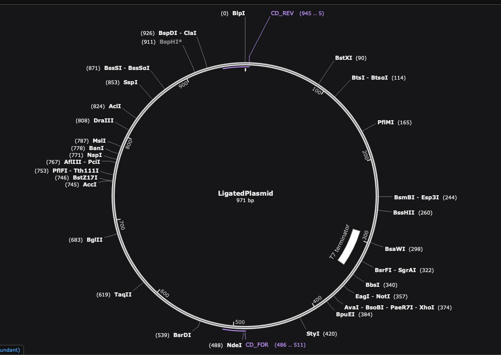

# Methods

## **An overview of the computational methods used**
<a href="https://pbl.biotech.iitm.ac.in/pStab/"><b>pStab web server:</b></a> The pStab webserver predicts the variation in stability of protein mutants under varying experimental conditions of ionic strength and temperature using the electrostatic  Debye-Hückel interaction energy of charged residues. A structure based statistical mechanical model is then employed to predict the thermal stability of the mutants. The server gives a stability-sorted list of the top 5000 mutants ordered based on their net electrostatic interaction energies and locations of mutational hotspots.
{: style="width:500px; margin:20px;display: block;margin-left: auto;margin-right: auto;"}

<a href="https://www.ddl.unimi.it/vegaol/propka.htm"><b>propKa:</b></a> propKa web server provides an empirical method to predict the variation of pKa values of protein’s side chains based on the position of the group and chemical interactions with other groups in its vicinity. Using the tool, Intra-protein electrostatic interactions of the amino acid residues at the active site of the target enzyme was identified. Any mutation affecting amino acid residues interacting with the active site amino acid residues was avoided. 
{: style="width:500px; margin:20px;display: block;margin-left: auto;margin-right: auto;"}

<a href="https://pymol.org/2/"><b>pyMOL:</b></a> pyMOL is a powerful molecular simulation software to visualize the three dimensional structure of proteins and other macromolecules. pyMOL was used to generate the PDB files of stable mutant enzymes identified from the pStab server. The PDB of the mutant molecule was uploaded to pSTAB and the electrostatic energy of the triple mutants were obtained to analyze their stability.
{: style="width:500px; margin:20px;display: block;margin-left: auto;margin-right: auto;"}

## **An overview of the Experimental Design**

<h2 style="margin: 0 !important;">Bacterial Strains</h2>

<ul>
  <li>
The bacterial strain E. coli GIA39 (DE3) is used in the cloning process.
</li>
  <li>
The strain is a cytosine deaminase deficient strain which is used for genetic complementation assays to verify cytosine deaminase activity.
</li>
  <li>
The strain E. coli BL21(DE3) is used for protein overexpression.
</li>
  <li>
As for the Vector backbone that will be carrying the yCD gene, the plasmid pET15b is chosen.
</li>
  <li>
Restriction enzymes NdeI and BlpI are chosen within the T7 region, which is present in the plasmid.
</li>
  <li>
The plasmid will be digested by enzymes at sites NdeI and BlpI to insert the yCD gene.
</li>
</ul>

<h2 style="margin: 0 !important;">Primer Design</h2>

<ul>
  <li>
yCD gene sequence from Saccharomyces cerevisiae genome is imported to SnapGene software
</li>
  <li>
The ideal primers are expected to have a melting temperature (Tm) in the range of 55°C to 70°C with flanking sequences that do not support dimer formation.
</li>
  <li>
The forward and reverse primers are designed using tools in SnapGene. They have melting temperatures of 64°C and 65°C respectively with GC stability in the range of 40 - 50%. The primers have a size of 30-40 nucleotides with the common flanking sequence, TAAGCA, to ensure precise restriction digestion. 
</li>
  <li>
The ligation of the yCD gene with the plasmid vector is ensured by including compatible restriction sites NdeI in the forward primer and BamHI in the reverse primer.
</li>
  <li>
The yCD gene is then PCR-amplified with the designed primers in SnapGene, followed by its ligation with the double-digested pET15b vector at the NdeI and BlpI restriction sites.
</li>
</ul>

Forward (31mer, Tm =59℃) : TAAGCACATATGATGGTGACAGGGGGAATGG  
Reverse (38mer, Tm=55℃) : TAAGCAGCTNAGCCTACTCACCAATATCTTCAAACCAA

{: style="width:500px; margin:20px;display: block;margin-left: auto;margin-right: auto;"}
{: style="width:500px; margin:20px;display: block;margin-left: auto;margin-right: auto;"}
{: style="width:500px; margin:20px;display: block;margin-left: auto;margin-right: auto;"}

<h2 style="margin: 0 !important;">Error prone PCR</h2>

<ul>
  <li>
Creating a diverse library of mutants is a critical step in any directed evolution project. 
</li>
  <li>
Methods to create such a library fall into three major categories – random mutagenesis, focused mutagenesis, and DNA recombination.
</li>
  <li>
In random mutagenesis, mutations are randomly introduced in the gene in and the mutants thus formed are screened for desired properties. This form of mutagenesis is carried out using error-prone PCR (epPCR).
</li>
  <li>
This method involves the enhancement of the intrinsic error rate of Taq polymerase by the addition of Mn2+ to the reaction buffer. This reduces the base pairing specificity. Alternatively, the ratios of deoxynucleotide triphosphates present can be modified to reduce specificity of pairing.
</li>
  <li>
The advantages of this method include easy access to the library creation method and cost effective nature of mutagenesis. This method of mutation produces a balanced mutational spectrum without codon bias as seen in chemical mutagens. Entirely unpredictable mutations can generate substantial gains in useful properties.
</li>
  <li>
However, due to its generation of random mutations, this method has a lower chance of producing the desired mutant.
</li>
  <li>
This can be overcome by carrying out high- throughput screening of mutants.
</li>
  <li>
Prior to performing the actual mutagenesis experiment, it is necessary to determine the amplification efficiency of the PCR cycle. 
</li>
  <li>
This can be done by amplifying a known amount of DNA under epPCR conditions, followed by quantification using ethidium bromide-stained agarose gel. 
</li>
  <li>
The average number of mutations per template increases with the number of epPCR doublings. One epPCR cycle increases the amount of DNA by a factor of 1.7 1o 1.9.
</li>
  <li>
Using this amplification efficiency, we can determine the number of doublings per cycle. Thus, we can determine the number of cycles necessary to achieve the desired number of mutations per template. 
</li>
  <li>
The FCY1 gene encoding cytosine deaminase in yeast is 803 bp long, and 2 mutations is the minimum necessary to show significant activity modification. At the minimum rate of DNA increase per cycle of 1.7, 5 epPCR doublings would be necessary. This is equivalent to,2 51.7 ≈ 19 cycles.
</li>
  <li>
Random mutagenesis by error prone PCR : EP-PCR is used to introduce random mutations in the gene encoding yCD. The 5’ and 3’ boundaries of the mutated region have been defined using the primers: 
</li>
</ul>

{: style="width:500px; margin:20px;display: block;margin-left: auto;margin-right: auto;"}

Source: https://link.springer.com/protocol/10.1007/978-1-60761-652-8_7

<h2 style="margin: 0 !important;">Protein expression and purification</h2>

<ul>
  <li>
The expression of the protein of interest is induced by the addition of IPTG (Isopropyl β-D-1-thiogalactopyranoside) after the culture with the transformants reaches a saturated stage.
</li>
  <li>
The cells are harvested after incubation.
</li>
  <li>
The lysates are prepared under denaturing conditions.
</li>
  <li>
The batch purification is performed in an IMAC column containing Ni-NTA Agarose beads and analyzed by SDS-PAGE.
</li>
</ul>
{: style="width:500px; margin:20px;display: block;margin-left: auto;margin-right: auto;"}

Source: https://www.biologicscorp.com/blog/iptg-induction-protein-expression/#.Y0HlZ3ZBy3A

{: style="width:500px; margin:20px;display: block;margin-left: auto;margin-right: auto;"}

Source: https://www.researchgate.net/publication/313021038_Highly_selective_magnetic_affinity_purification_of_histidine-tagged_proteins_by_Ni_2_carrying_monodisperse_composite_microspheres

<h2 style="margin: 0 !important;">Protein enzymatic activity assays at constant pH </h2>
The conversion of 5FC to 5FU by yCD will be measured spectrophotometrically by monitoring change in absorbance at 238nm.
<ul>
  <li>
The conversion of 5FC to 5FU by yCD is measured spectrophotometrically by monitoring the change in absorbance spectrum at 238 nm.
</li>
  <li>
The protein is diluted in TrisCl at a fixed pH (with setups ranging from pH6 to pH7 in increments) and the enzymatic activity is assayed. , The initial reaction velocity and initial slope are calculated (after averaging multiple measurements to reduce error) by fitting a curve to the values obtained.
</li>
  <li>
A double reciprocal (Lineweaver-Burk) plot is constructed and Km and kcat values of the enzymes are obtained to calculate the catalytic efficiency (kcat/Km).
</li>
</ul>
{: style="width:500px; margin:20px;display: block;margin-left: auto;margin-right: auto;"}

Source: https://www.spandidos-publications.com/10.3892/or.2013.2584

[Back to top](#)
