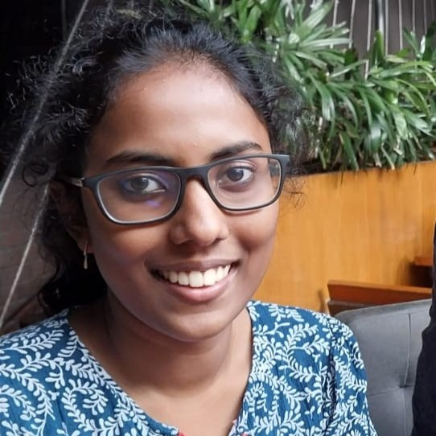
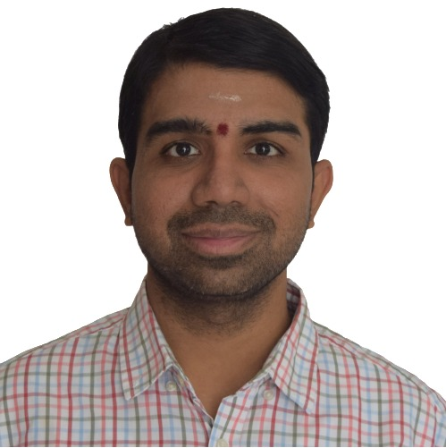
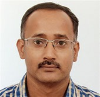

# **Our Team**

## **Core Team**

**Shobhan Karthick | <a href="mailto:karthickshobhan@gmail.com">karthickshobhan@gmail.com</a>**

{: style="height:200px;width:200px; margin:20px"}

Shobhan Karthick is a fourth-year Biological Engineering student who is a synthetic biology enthusiast. He loves learning new crazy stuff to satisfy his curiosity. He spends his free time reading short comics, doing some carpentry or some coding. He is quite lazy but uses amazing automations as a work around.

**Varshini S | <a href="mailto:be19b006@smail.iitm.ac.in">be19b006@smail.iitm.ac.in</a>**

{: style="height:200px;width:200px; margin:20px"}

Varshini is a fourth-year Biological Engineering student at IIT Madras and a true Biotech Enthusiast. She says 'Cap me and tail me, I'll translate to mind blowing information!'

## **Lab Heads**

**Aarohee Vora | <a href="mailto:bs2002@smail.iitm.ac.in">bs2002@smail.iitm.ac.in</a>**

{: style="height:200px;width:200px; margin:20px"}

Aarohee is a third-year undergraduate student in Biosciences at IIT Madras. She is very passionate about research and her interests lie in Synthetic Biology, Immunology, Therapeutics and Genetics. She is eager to unravel the mysteries of the microscopic world, humming along with nature and its evolving hues... Amongst other things, she enjoys travelling, art and playing badminton! To read her story, decode her genome... 

**Sanjana Adluru | <a href="mailto:be20b028@smail.iitm.ac.in">be20b028@smail.iitm.ac.in</a>**

{: style="height:200px;width:200px; margin:20px"}

Sanjana Adluru is a third-year student in Biological Engineering. She's passionate about singing and has watched a fair share of sitcoms to last her a lifetime. She is keenly interested in the fields of oncology, immunology, genomics and synthetic biology. She strives to take up projects which bring about beneficial change in the world. 

**Ashvita Saishaa Ponnada  | <a href="mailto:be20b007@smail.iitm.ac.in">be20b007@smail.iitm.ac.in</a>**

{: style="height:200px;width:200px; margin:20px"}

Ashvita is a third-year undergraduate majoring in Biological engineering at IIT Madras. She has an avid interest towards the fields of genetics, genomics and synthetic biology. Apart from being a huge gossip and lipbalm addict, she is passionate about singing and classical dance, and is a voracious reader. 

**Prahalaad Vijay Varahaswami | <a href="mailto:prahalaad@smail.iitm.ac.in">prahalaad@smail.iitm.ac.in</a>**

{: style="height:200px;width:200px; margin:20px"}

Prahalaad is a third-year undergraduate in Biological Engineering. He is passionate about classical music and Indian percussion is his jam. He also loves biology jokes, He'd tell you one but it'll get lost in translation, just like introns. 

## **Lab Members**

**Ananya Sangeetha Nagarjunan | <a href="mailto:hiananya@gmail.com">hiananya@gmail.com</a>**

{: style="height:200px;width:200px; margin:20px"}

Ananya is a third-year student of Biological Sciences at the Indian Institute of Technology, Madras. Her primary research interests lie in evolutionary genetics and biomaterials, with an avid fascination with marine biology. She aims to introduce the sense of sustainability into every research project undertaken, and also invests time incorporating biomimetic principles in said projects. 

**Anirudh Rao | <a href="mailto:be21b004@smail.iitm.ac.in">be21b004@smail.iitm.ac.in</a>**

{: style="height:200px;width:200px; margin:20px"}

Anirudh Rao is a second-year Biological Engineering student. His life revolves around academics and cryptic crosswords. He needs therapy, but would rather watch terrible rom-coms. He is also more interested in other peoples’ drama than anything on TV. Monkeys terrify him sufficiently to merit an honor guard for protection.

**Ashna Narain | <a href="mailto:be21b008@smail.iitm.ac.in">be21b008@smail.iitm.ac.in</a>**

{: style="height:200px;width:200px; margin:20px"}

Ashna is a second-year student of Biological Engineering at the Indian Institute of Technology, Madras.She has always enjoyed biology and would love to explore it further. Apart from biology, she enjoys drawing and classical dance.

**Bavishya Suresh Manju Bashini  | <a href="mailto:be20b009@smail.iitm.ac.in">be20b009@smail.iitm.ac.in</a>**

{: style="height:200px;width:200px; margin:20px"}

Bavishya is a third-year undergraduate in Biological Engineering. She doesn’t give up on dreams by continuing to sleep. She admires genetics so much that she got her genome sequenced. It came back with four main components: Amusing, Geeky, Tea and Chocolate with SNPs like melody and binging period dramas being predominant.

**Keshav Krishna M B | <a href="mailto:be20b018@smail.iitm.ac.in">be20b018@smail.iitm.ac.in</a>**

{: style="height:200px;width:200px; margin:20px"}

Keshav Krishna is a third-year Biological Engineering student at IIT Madras. His primary interests lie in Genetics and neuroscience. On the non-academic front he enjoys painting, singing and binging stories with good writing irrespective of the media. He is always open to an intellectual challenge.

**Twisha Shivashankar | <a href="mailto:be21b042@smail.iitm.ac.in">be21b042@smail.iitm.ac.in</a>**

{: style="height:200px;width:200px; margin:20px"}

Twisha is a second-undergraduate student in the Biological Engineering course of IIT Madras and is from Bangalore. Beyond academics, she engages herself in art and craft, and plays the guitar and keyboard. She is also an avid badminton player.

**Anirudh TP | <a href="mailto:bs21b007@smail.iitm.ac.in">bs21b007@smail.iitm.ac.in</a>**

{: style="height:200px;width:200px; margin:20px"}

Anirudh TP is a second-year Undergraduate pursuing Biological Sciences from IIT Madras. He's a very enthusiastic and compassionate individual and likes to be very organized with his work. He is very interested in research and likes playing table tennis and watching movies.  

**Pranathi Ravikumar | <a href="mailto:bs21b023@gmail.com">bs21b023@gmail.com</a>**

{: style="height:200px;width:200px; margin:20px"}

Pranathi is a second-year undergraduate student majoring in Biological Sciences at IIT Madras. Apart from her keen interest in Biotechnology, she plays the violin, listens to music and is an avid reader.   

**Niharika Balasubramanian  | <a href="mailto:bs21b022@smail.iitm.ac.in">bs21b022@smail.iitm.ac.in</a>**

{: style="height:200px;width:200px; margin:20px"}

Niharika Balasubramanian is a second-year biological sciences student at IIT Madras. She has always been a bit of a distracted person, never actually doing what she’s supposed to be, but somehow what she actually does ends up being useful. She enjoys reading, baking, and crochet, but would like to remind everyone that she’s the most useful one in the case of a zombie apocalypse.  

**Malavika Venkatesh  | <a href="mailto:bs20b020@smail.iitm.ac.in">bs20b020@smail.iitm.ac.in</a>**

{: style="height:200px;width:200px; margin:20px"}

Malavika is a third-year undergraduate in Biological Sciences with immense passion for scientific research and eagerness to learn new concepts. Her interests include Genetics, Molecular Biology and Biomimicry. She also love Badminton, Music, Dance and Painting! According to her, DNA tells Gene Therapy - " I think I'm addicted to replication because of my relationship with my parent strand" 

## **WebOps Team**

**Krushna Sharad Sinnarkar | <a href="mailto:krushnasinnarkar@gmail.com">krushnasinnarkar@gmail.com</a>**

{: style="height:200px;width:200px; margin:20px"}

**Sagar Sugunan | <a href="mailto:na20b054@smail.iitm.ac.in">na20b054@smail.iitm.ac.in</a>**

{: style="height:200px;width:200px; margin:20px"}

## **Faculty Advisors**

**Dr. Karthik Raman**

{: style="height:200px;width:200px; margin:20px"}

Dr. Karthik Raman is an Associate Professor at the Department of Biotechnology, Bhupat & Jyoti Mehta School of Biosciences, Indian Institute of Technology Madras. He co-founded and co-ordinates the Initiative for Biological Systems Engineering and is a core member of the Robert Bosch Centre for Data Science and Artificial Intelligence (RBCDSAI). He has been a researcher in the area of systems biology for the last 15+ years and has been teaching a course on systems biology for the last eight years, to (mostly) engineers from different backgrounds. His lab works on computational approaches to understand and manipulate biological networks, with applications in metabolic engineering and synthetic biology.

**Dr. Athi Narayanan Naganathan**

{: style="height:200px;width:200px; margin:20px"}

Dr. Athi Narayanan Naganathan is an Associate Professor at the Department of Biotechnology, Bhupat & Jyoti Mehta School of Biosciences, Indian Institute of Technology Madras. His lab works on the experimental characterization of protein conformational behavior, modeling and predicting folding landscapes using statistical models, understanding protein folding and dynamics through coarse-grained and all-atom molecular simulations, and multi-scale exploration of protein conformational ensembles. He has been recently honoured with the Young Faculty Recognition Award, IIT Madras, India (2020), Institute Research and Development Award, IIT Madras, India (2019) and JSPS Invitational Fellowship for Research in Japan (2019).

 
[Back to top](#)
